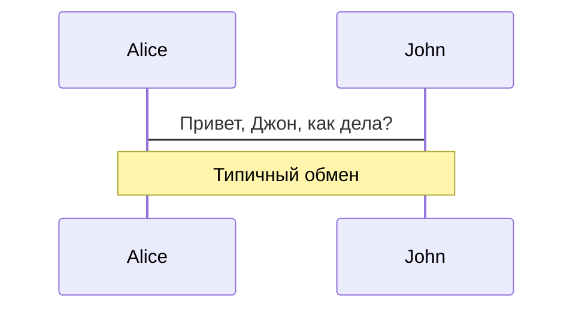
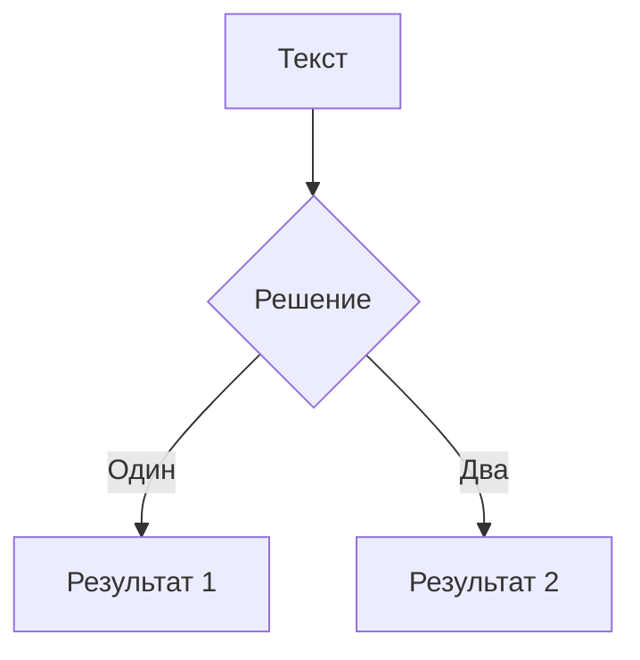

# Синтаксис Markdown

Слайды пишутся в **одном markdown файле** (по умолчанию `./slides.md`).

Вы можете использовать [возможности Markdown](https://github.com/adam-p/markdown-here/wiki/Markdown-Cheatsheet) как обычно, с дополнительной поддержкой встроенного HTML и Vue компонентов. Также поддерживается стилизация с использованием [UnoCSS](/custom/config-unocss). Используйте `---` с новой строки до и после для разделения слайдов.

````md
# Slidev

Привет, мир!

---

# Страница 2

Используйте блоки кода напрямую для подсветки синтаксиса

```ts
console.log('Привет, мир!')
```

---

# Страница 3

Вы можете напрямую использовать Windi CSS и Vue компоненты для стилизации и обогащения ваших слайдов.

<div class="p-3">
  <Tweet id="20" />
</div>
````

## Frontmatter и макеты

Укажите макеты и другие метаданные для каждого слайда, преобразовав разделители в [блоки frontmatter](https://jekyllrb.com/docs/front-matter/). Каждый frontmatter начинается с тройного тире и заканчивается другим. Текст между ними - это объекты данных в формате [YAML](https://www.cloudbees.com/blog/yaml-tutorial-everything-you-need-get-started/). Например:

<!-- eslint-skip -->

```md
---
layout: cover
---

# Slidev

Это титульная страница.

---
layout: center
background: /background-1.png
class: 'text-white'
---

# Страница 2

Это страница с макетом `center` и фоновым изображением.

---

# Страница 3

Это страница по умолчанию без дополнительных метаданных.
```

Обратитесь к разделу [настройка](/custom/) для получения дополнительной информации.

### Поддержка Prettier

> Доступно с версии v0.44

Пользовательский синтаксис может быть несовместим с некоторыми форматтерами, такими как Prettier.
Вы можете либо установить [Prettier Plugin](/guide/editors#prettier-plugin), либо использовать прямой блок кода `yaml` для определения frontmatter:

````md
---
layout: cover
---

# Slidev

Это титульная страница.

---

```yaml
# Первый yaml блок будет рассматриваться как frontmatter этого слайда
layout: center
background: /background-1.png
class: 'text-white'
```

# Страница 2

Это страница с макетом `center` и фоновым изображением.
````

## Блоки кода

Одной из главных причин создания Slidev была необходимость идеального отображения кода на слайдах. Следовательно, вы можете использовать блоки кода в стиле Markdown для подсветки вашего кода.

````md
```ts
console.log('Привет, мир!')
```
````

Slidev имеет встроенный [Shiki](https://github.com/shikijs/shiki) в качестве подсветки синтаксиса. Обратитесь к [разделу о подсветке синтаксиса](/custom/highlighters) для получения дополнительной информации.

### Подсветка строк

Чтобы подсветить определенные строки, просто добавьте номера строк в фигурных скобках `{}`. Нумерация строк по умолчанию начинается с 1.

````md
```ts {2,3}
function add(
  a: Ref<number> | number,
  b: Ref<number> | number
) {
  return computed(() => unref(a) + unref(b))
}
```
````

Чтобы изменить подсветку при нескольких кликах, вы можете использовать `|` для разделения каждого этапа:

````md
```ts {2-3|5|all}
function add(
  a: Ref<number> | number,
  b: Ref<number> | number
) {
  return computed(() => unref(a) + unref(b))
}
```
````

Это сначала подсветит `a: Ref<number> | number` и `b: Ref<number> | number`, затем `return computed(() => unref(a) + unref(b))` после одного клика, и наконец, весь блок.

Вы можете установить номер строки на `hide`, чтобы скрыть блок кода, или `none`, чтобы не подсвечивать ни одну строку:

````md
```ts {hide|none}
function add(
  a: Ref<number> | number,
  b: Ref<number> | number
) {
  return computed(() => unref(a) + unref(b))
}
```
````

::: tip
Узнайте больше в [руководстве по анимации кликов](./animations#positioning).
:::

### Нумерация строк

Вы можете включить нумерацию строк для всех слайдов, установив `lineNumbers: true` в глобальной конфигурации, или включить каждый блок кода индивидуально, установив `lines: true`. Вы также можете установить начальную строку для каждого блока кода и подсветить строки соответственно; по умолчанию начинается с 1:

````md
```ts {6,7}{lines:true,startLine:5}
function add(
  a: Ref<number> | number,
  b: Ref<number> | number
) {
  return computed(() => unref(a) + unref(b))
}
```
````

### Максимальная высота

Если код не помещается на один слайд, вы можете использовать `maxHeight` для установки фиксированной высоты и включения прокрутки:

````md
```ts {2|3|7|12}{maxHeight:'100px'}
function add(
  a: Ref<number> | number,
  b: Ref<number> | number
) {
  return computed(() => unref(a) + unref(b))
}
/// ...столько строк, сколько вы хотите
const c = add(1, 2)
```
````

### Интеграция TwoSlash

> Доступно с версии v0.46

Эта функция доступна только когда вы [устанавливаете `highlighter` в `shiki`](/custom/highlighters)

[TwoSlash](https://twoslash.netlify.app/) - это мощный инструмент для рендеринга блоков кода TypeScript с информацией о типах при наведении курсора или встроенной. Это очень полезно при подготовке слайдов для тем, связанных с JavaScript/TypeScript.

Чтобы использовать его, вы можете добавить `twoslash` к идентификатору языка блока кода:

````md
```ts twoslash
import { ref } from 'vue'

const count = ref(0)
//            ^?
```
````

Это будет отображено как:

```ts twoslash
import { ref } from 'vue'

const count = ref(0)
//            ^?
```

<!-- Чтобы всплывающее окно не перекрывало содержимое ниже -->
<div class="py-20" />

### Shiki Magic Move

> Доступно с версии v0.48

[Shiki Magic Move](https://github.com/shikijs/shiki-magic-move) позволяет вам иметь детальный переход между изменениями кода, подобно Magic Move в Keynote. Вы можете проверить [playground](https://shiki-magic-move.netlify.app/), чтобы увидеть, как это работает.

<video src="https://github.com/slidevjs/slidev/assets/11247099/79927794-27ba-4342-9911-9996cec889d6" controls rounded shadow w-full></video>

В Slidev мы привязываем magic-move к [системе кликов](/guide/animations#click-animations). Синтаксис заключается в обертывании нескольких блоков кода, представляющих каждый шаг, с помощью <code>````md magic-move</code> (обратите внимание, это **4** обратных апострофа), это будет преобразовано в один блок кода, который морфируется в каждый шаг при клике.

`````md
````md magic-move
```js
console.log(`Шаг ${1}`)
```
```js
console.log(`Шаг ${1 + 1}`)
```
```ts
console.log(`Шаг ${3}` as string)
```
````
`````

Также возможно комбинировать Magic Move с [подсветкой строк](#подсветка-строк) и [нумерацией строк](#нумерация-строк), например:

`````md
````md magic-move {at:4, lines: true} // [!code hl]
```js {*|1|2-5} // [!code hl]
let count = 1
function add() {
  count++
}
```

Не-кодовые блоки между ними игнорируются, вы можете добавить некоторые комментарии.

```js {*}{lines: false} // [!code hl]
let count = 1
const add = () => count += 1
```
````
`````

<!-- TODO: добавить встроенную демонстрацию -->

### Редактор Monaco

Когда вы хотите внести некоторые изменения в презентацию, просто добавьте `{monaco}` после идентификатора языка — это превращает блок в полнофункциональный редактор Monaco!

````md
```ts {monaco}
console.log('ПриветМир')
```
````

Узнайте больше о [настройке Monaco](/custom/config-monaco).

#### Monaco Diff

Monaco также может генерировать разницу между двумя блоками кода. Используйте `{monaco-diff}`, чтобы превратить блок в [diff Monaco редактор](https://microsoft.github.io/monaco-editor/playground.html?source=v0.36.1#example-creating-the-diffeditor-multi-line-example) и используйте `~~~` для разделения оригинальной и измененной версий кода!

````md
```ts {monaco-diff}
Эта строка удалена справа.
просто некоторый текст
abcd
efgh
Еще немного текста
~~~
просто некоторый текст
abcz
zzzzefgh
Еще немного текста.
Эта строка удалена слева.
```
````

Он предоставляет редактор с кнопкой "Запустить" и показывает результат выполнения кода прямо под блоком кода. Вы также можете изменить код, и результат будет пересчитан на лету.

По умолчанию он автоматически запускает код при загрузке слайда; если вы хотите вместо этого явно запускать выполнение, вы можете установить `{autorun:false}`.

````md
```ts {monaco-run} {autorun:false}
console.log('Нажмите кнопку воспроизведения, чтобы запустить меня')
```
````

Если вы хотите показывать вывод только при определенных кликах, вы можете использовать свойство `showOutputAt`. Значение такое же, как у `v-click`.

````md
```ts {monaco-run} {showOutputAt:'+1'}
console.log('Показано после 1 клика')
```
````

В настоящее время Slidev поддерживает выполнение кода JavaScript и TypeScript из коробки. Обратитесь к [Пользовательским исполнителям кода](/custom/config-code-runners) для поддержки пользовательских языков.

#### Редактируемый редактор Monaco

> Доступно с версии v0.49.5

Вы также можете использовать синтаксис [Импорт фрагментов кода](#импорт-фрагментов-кода) в сочетании с директивой `{monaco-write}`, чтобы связать ваш редактор Monaco с файлом в вашей файловой системе. Это позволит вам редактировать код непосредственно в редакторе и сохранять изменения обратно в файл.

```md
<<< ./some-file.ts {monaco-write}
```

При использовании этого обязательно сделайте резервную копию ваших файлов, так как изменения будут сохранены непосредственно в файл.

## Встроенные стили

Вы можете использовать тег `<style>` в вашем Markdown напрямую для переопределения стилей для **текущего слайда**.

```md
# Это красный

<style>
h1 {
  color: red
}
</style>

---

# Следующий слайд не затронут
```

Тег `<style>` в Markdown всегда [scoped](https://vuejs.org/api/sfc-css-features.html#scoped-css). В результате селектор с дочерним комбинатором (`.a > .b`) не может быть использован как таковой; см. предыдущую ссылку. Чтобы иметь глобальные переопределения стилей, ознакомьтесь с [разделом настройки](/custom/directory-structure#style).

Благодаря [UnoCSS](/custom/config-unocss), вы можете напрямую использовать вложенный css и [директивы](https://unocss.dev/transformers/directives) (например, `--uno:` или `@apply`)

```md
# Slidev

> Привет `мир`

<style>
blockquote {
  code {
    --uno: text-teal-500 dark:text-teal-400;
  }
}
</style>
```

## Статические ресурсы

Как и в обычном markdown, вы можете использовать изображения, указывая на удаленный или локальный URL.

Для удаленных ресурсов встроенный [`vite-plugin-remote-assets`](https://github.com/antfu/vite-plugin-remote-assets) будет кэшировать их на диск при первом запуске, обеспечивая мгновенную загрузку даже для крупных изображений позже.

```md

```

Для локальных ресурсов поместите их в [папку `public`](/custom/directory-structure.html#public) и ссылайтесь на них с **ведущим слешем**.

```md

```

Для того, чтобы применить пользовательские размеры или стили, вы можете преобразовать их в тег ``

```html

```

## Заметки

Вы также можете создавать заметки для каждого слайда. Они появятся в [Режиме докладчика](/guide/presenter-mode) для вашего справки во время презентаций.

В Markdown последний блок комментариев в каждом слайде будет рассматриваться как заметка.

```md
---
layout: cover
---

# Страница 1

Это титульная страница.

<!-- Это заметка -->

---

# Страница 2

<!-- Это НЕ заметка, потому что она предшествует содержимому слайда -->

Вторая страница

<!--
Это еще одна заметка
-->
```

Поддерживается базовый Markdown и HTML в заметках, когда докладчик отображает содержимое заметок.

### Маркеры кликов

> Доступно с версии v0.48

Для некоторых слайдов ваши заметки могут быть длинными и сложно найти свое место. Slidev поддерживает маркеры кликов, которые позволяют выделять и автоматически прокручивать раздел заметок в соответствии с вашим содержимым. Поместите маркеры `[click]` в начало любой строки в ваших заметках для времени, которое вам нужно перейти к другому [клику](/guide/animations#click-animations). Вы можете пропустить `n` кликов, используя `[click:{n+1}]`. Например:

```md
<!--
Содержимое до первого клика

[click] Это будет выделено после первого клика

Также выделено после первого клика

- [click] Этот элемент списка будет выделен после второго клика

[click:3] Последний клик (пропустить два клика)
-->
```

Slidev разделяет содержимое между маркерами кликов и выделяет его в заметках докладчика, синхронизируясь с прогрессом вашего слайда.

<!-- TODO: добавить видео -->

## Иконки

Slidev позволяет вам иметь доступ практически ко всем открытым наборам иконок **напрямую** в вашем markdown после установки соответствующего пакета. Поддерживается [`unplugin-icons`](https://github.com/antfu/unplugin-icons) и [Iconify](https://iconify.design/).

Именование следует соглашению [Iconify](https://iconify.design/) о `{collection-name}-{icon-name}`. Например:

- `<mdi-account-circle />` - <mdi-account-circle /> из [Material Design Icons](https://github.com/Templarian/MaterialDesign) - [`@iconify-json/mdi`](https://npmjs.com/package/@iconify-json/mdi)
- `<carbon-badge />` - <carbon-badge /> из [Carbon](https://github.com/carbon-design-system/carbon/tree/main/packages/icons) - [`@iconify-json/carbon`](https://npmjs.com/package/@iconify-json/carbon)
- `<uim-rocket />` - <uim-rocket /> из [Unicons Monochrome](https://github.com/Iconscout/unicons) - [`@iconify-json/uim`](https://npmjs.com/package/@iconify-json/uim)
- `<twemoji-cat-with-tears-of-joy />` - <twemoji-cat-with-tears-of-joy /> из [Twemoji](https://github.com/twitter/twemoji) - [`@iconify-json/twemoji`](https://npmjs.com/package/@iconify-json/twemoji)
- `<logos-vue />` - <logos-vue /> из [SVG Logos](https://github.com/gilbarbara/logos) - [`@iconify-json/logos`](https://npmjs.com/package/@iconify-json/logos)
- И многое другое...

Обзор и поиск всех доступных иконок можно выполнить с помощью [Icônes](https://icones.js.org/).

### Стилизация иконок

Вы можете стилизовать иконки так же, как и другие HTML-элементы. Например:

```html
<uim-rocket />
<uim-rocket class="text-3xl text-red-400 mx-2" />
<uim-rocket class="text-3xl text-orange-400 animate-ping" />
```

<uim-rocket />
<uim-rocket class="text-3xl text-red-400 mx-2" />
<uim-rocket class="text-3xl text-orange-400 animate-ping ml-2" />

## Слоты

> Доступно с версии v0.18

Некоторые макеты могут предоставлять несколько вкладок с помощью [именованных слотов Vue](https://v3.vuejs.org/guide/component-slots.html).

Например, в [`two-cols` макете](https://github.com/slidevjs/slidev/blob/main/packages/client/layouts/two-cols.vue), вы можете иметь две колонки слева (`default` слот) и справа (`right` слот) рядом друг с другом.

```md
---
layout: two-cols
---

<template v-slot:default>

# Левая

Это показывается слева

</template>
<template v-slot:right>

# Правая

Это показывается справа

</template>
```

<div class="grid grid-cols-2 rounded border border-gray-400 border-opacity-50 px-10 pb-4">
<div>
<h3>Левая</h3>
<p>Это показывается слева</p>
</div>
<div>
<h3>Правая</h3>
<p>Это показывается справа</p>
</div>
</div>

Мы также предоставляем синтаксический сахар `::name::` для имени слота. Следующий пример работает точно так же, как предыдущий.

```md
---
layout: two-cols
---

# Левая

Это показывается слева

::right::

# Правая

Это показывается справа
```

Вы также можете явно указать слот по умолчанию и предоставить его в произвольном порядке.

```md
---
layout: two-cols
---

::right::

# Правая

Это показывается справа

::default::

# Левая

Это показывается слева
```

## Импорт фрагментов кода

> Доступно с версии v0.47.0

Вы можете импортировать фрагменты кода из существующих файлов с помощью следующего синтаксиса:

```md
<<< @/snippets/snippet.js
```

::: tip
Значение `@` соответствует корню источника, каталогу, в котором находится `slides.md`.
:::

Эта функция вендорится из VitePress, узнайте больше о ней в [документации VitePress](https://vitepress.dev/guide/markdown#import-code-snippets).

## Конфигурации

Все конфигурации могут быть определены в файле Markdown. Например:

```md
---
theme: seriph
layout: cover
background: 'https://source.unsplash.com/1600x900/?nature,water'
---

# Slidev

Это титульная страница.
```

Узнайте больше о [конфигурациях frontmatter](/custom/#frontmatter-configures).

## LaTeX

Slidev поставляется с встроенной поддержкой LaTeX, основанной на [KaTeX](https://katex.org/).

<TheTweet id="1392246507793915904" />

### Встроенный

Обрамите ваш LaTeX одним `$` с каждой стороны для встроенного рендеринга.

```md
$\sqrt{3x-1}+(1+x)^2$
```

### Блок

Используйте два (`$$`) для блочного рендеринга. Этот режим использует большие символы и центрирует
результат.

```latex
$$
\begin{array}{c}

\nabla \times \vec{\mathbf{B}} -\, \frac1c\, \frac{\partial\vec{\mathbf{E}}}{\partial t} &
= \frac{4\pi}{c}\vec{\mathbf{j}}    \nabla \cdot \vec{\mathbf{E}} & = 4 \pi \rho \\

\nabla \times \vec{\mathbf{E}}\, +\, \frac1c\, \frac{\partial\vec{\mathbf{B}}}{\partial t} & = \vec{\mathbf{0}} \\

\nabla \cdot \vec{\mathbf{B}} & = 0

\end{array}
$$
```

Узнайте больше: [Демо](https://sli.dev/demo/starter/8) | [KaTeX](https://katex.org/) | [`markdown-it-katex`](https://github.com/waylonflinn/markdown-it-katex)

### Подсветка строк LaTeX

> Доступно с версии v0.43.1

Чтобы подсветить определенные строки, просто добавьте номера строк в фигурных скобках `{}`. Нумерация строк по умолчанию начинается с 1.

```latex
$$ {1|3|all}
\begin{array}{c}
\nabla \times \vec{\mathbf{B}} -\, \frac1c\, \frac{\partial\vec{\mathbf{E}}}{\partial t} &
= \frac{4\pi}{c}\vec{\mathbf{j}}    \nabla \cdot \vec{\mathbf{E}} & = 4 \pi \rho \\
\nabla \times \vec{\mathbf{E}}\, +\, \frac1c\, \frac{\partial\vec{\mathbf{B}}}{\partial t} & = \vec{\mathbf{0}} \\
\nabla \cdot \vec{\mathbf{B}} & = 0
\end{array}
$$
```

Опции `at` и `finally` из [блоков кода](#подсветка-строк) также доступны для блоков LaTeX.

## Диаграммы

Вы также можете создавать диаграммы / графики из текстовых описаний в вашем Markdown, поддерживаемые [Mermaid](https://mermaid-js.github.io/mermaid).

Блоки кода, помеченные как `mermaid`, будут преобразованы в диаграммы, например:

````md

````

Вы также можете передать объект опций в него для указания масштабирования и темы. Синтаксис объекта - это литерал объекта JavaScript, вам потребуется добавлять кавычки (`'`) для строк и использовать запятую (`,`) между ключами.

````md

````

Узнайте больше: [Демо](https://sli.dev/demo/starter/9) | [Mermaid](https://mermaid-js.github.io/mermaid)

## Множественные входы

> Доступно с версии v0.15

Вы можете разделить ваш `slides.md` на несколько файлов и организовать их как вам удобно.

`slides.md` :

<!-- eslint-skip -->

```md
# Страница 1

Это обычная страница

---
src: ./subpage2.md
---

<!-- эта страница будет загружена из './subpage2.md' -->
Встроенное содержимое будет игнорироваться
```

`subpage2.md` :

```md
# Страница 2

Эта страница из другого файла
```

### Объединение frontmatter

Вы можете предоставлять инструкции frontmatter как из вашего основного входа, так и из внешних markdown-страниц. Если в них есть дублирующиеся ключи, те, которые из **основного входа, имеют более высокий приоритет**. Например:

`slides.md` :

```md
---
src: ./cover.md
background: https://sli.dev/bar.png
class: text-center
---
```

`cover.md` :

```md
---
layout: cover
background: https://sli.dev/foo.png
---

# Обложка

Обложка
```

Они в конечном итоге будут эквивалентны следующей странице:

```md
---
layout: cover
background: https://sli.dev/bar.png
class: text-center
---

# Обложка

Обложка
```

### Переиспользование страниц

С поддержкой множественных входов повторное использование страниц может быть простым. Например:

```yaml
---
src: ./cover.md
---

---
src: ./intro.md
---

---
src: ./content.md
---

---
# повторное использование
src: ./content.md
---
```

## Синтаксис MDC

> Доступно с версии v0.43.0

Slidev поддерживает необязательный [синтаксис MDC (Markdown Components)](https://content.nuxtjs.org/guide/writing/mdc) поддерживаемый [`markdown-it-mdc`](https://github.com/antfu/markdown-it-mdc).

Вы можете включить его, добавив `mdc: true` в frontmatter вашего markdown-файла.

```mdc
---
mdc: true
---

Это [красный текст]{style="color:red"} :inline-component{prop="value"}

{width=500px lazy}

::block-component{prop="value"}
Слот **по умолчанию**
::
```

Узнайте больше о [синтаксисе MDC](https://content.nuxt.com/guide/writing/mdc).
